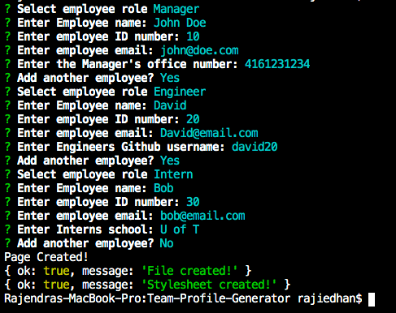
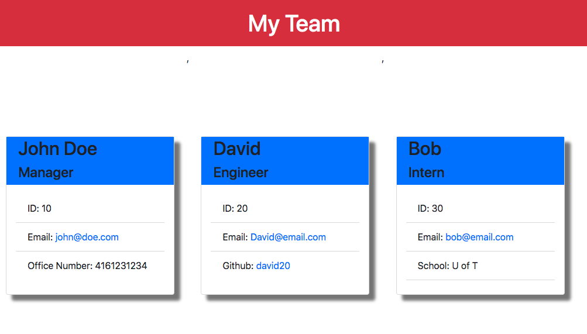

# **Team-Profile-Generator**

## Table of Contents

1. [Description](#description)
2. [License](#license)
3. [Screenshots](#screenshots)
4. [Demonstration](#demonstration)
5. [Questions](#questions)

### Description

Generate a webpage that displays a team's basic information.

### License

This application is covered under the [MIT](https://opensource.org/licenses/MIT) license.

### Screenshots

Visual of the command line inputs:

End result from the previous screenshot translated into webpage:

### Demonstration

[Click to view application walkthrough](https://drive.google.com/file/d/1FfhLCdXSESrVNAk9b5SasWKZiw9patYe/view)

### Questions

Github Username: **Rajendra-Dhanraj**

[Click to follow and view my Github profile!](https://github.com/Rajendra-Dhanraj)

Alternatively, I can be contacted via email: **Rajendra.Dhanraj@gmail.com**
